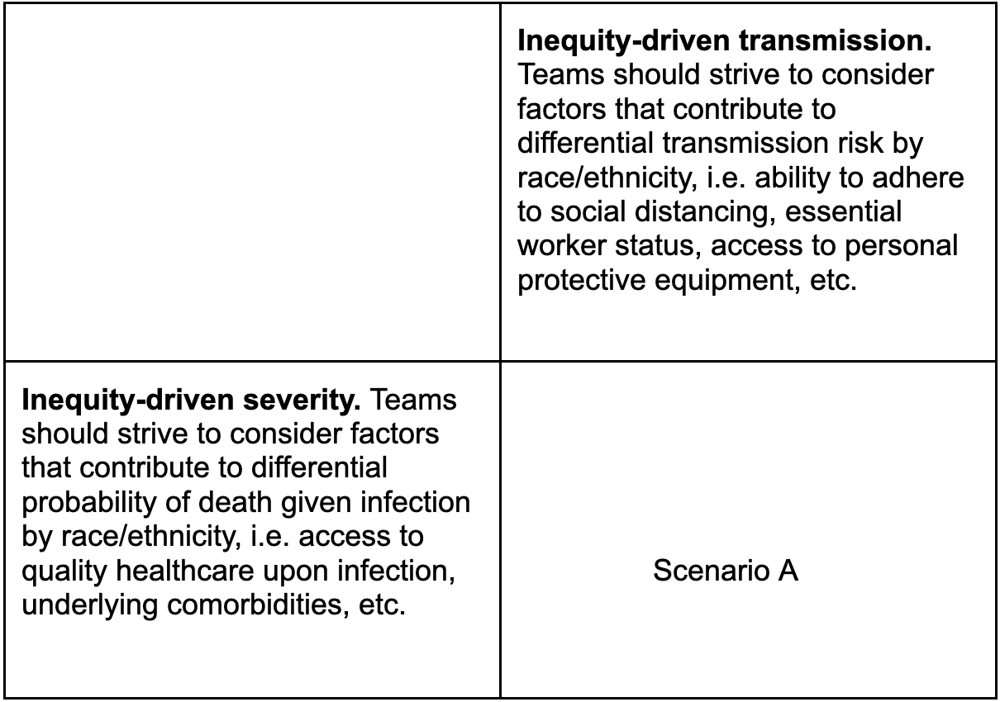
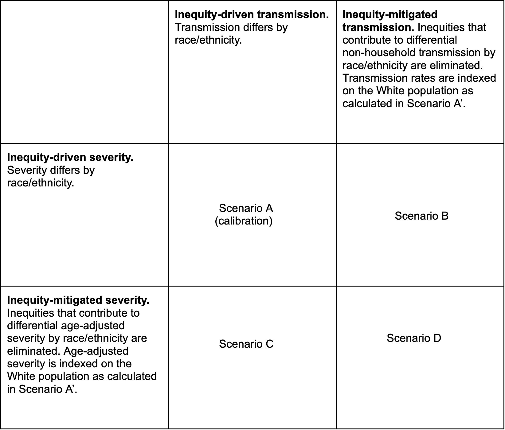

# COVID-19 Scenario Modeling Hub - Research

This repository follows the guidelines and standards outlined by the hubverse, 
which provides a set of data formats and open source tools for modeling hubs.

The Consortium of Infectious Disease Modeling Hubs. The hubverse: open tools for 
collaborative modeling. GitHub release v2.0.0, 14 Jul 2023. URL: https://github.com/Infectious-Disease-Modeling-Hubs

## Research vs. Operational Rounds

This repository is intended for the Scenario Modeling Hub's _research_ rounds, 
which are intended to encourage modeling to address specific research questions. 
Possibilities that have been discussed include the impact of disparities (described 
below) revisiting early stages of a pandemic. Additional research rounds may 
follow. 

The research rounds are distinct from the _operational_ rounds were the sole 
focus of the Scenario Modeling Hub from 
late 2020-April 2024. For information on those efforts, see the 
[operational round GitHub site](https://github.com/midas-network/covid19-scenario-modeling-hub).

## How to participate    

The Scenario Modeling Hub is open to any team willing to provide projections
at the right temporal and spatial scales, with minimal gatekeeping. We only 
require that participating teams share point estimates and uncertainty bounds, 
along with a short model description and answers to a list of key questions 
about design. A major output of the projection hub is ensemble estimates of 
epidemic outcomes (e.g., infection, hospitalizations, and deaths), for different
time points, intervention scenarios, and US jurisdictions.

Those interested to participate, please read the README file and email us at 
scenariohub@midasnetwork.us 

Model projections should be submitted via pull request to the 
[model-output/](./model-output/) folder and associated metadata should be 
submitted at the same time to the [model-metadata/](./model-metadata/) folder 
of this GitHub repository. 
Technical instructions for submission and required file formats can be found 
[here](./model-output/README.md), 
[here, for the metadata file](./model_metadata/README.md), and
[here, for the abstract file](./model-abstract/README.md)

## Disparities Round

We observed disparities in COVID-19 outcomes by sociodemographic factors such as
age, location, race/ethnicity, occupation, and socioeconomic status, yet most
epidemiological models do not account for structural inequities that contribute
to differential transmission and severity risk among these groups. This round
aims to build multi-model capacity within the Scenario Modeling Hub to model
and project how disease is distributed differentially among racial/ethnic
subpopulations. A secondary goal is to retrospectively assess the COVID-19
disease burden that could have been averted if various sources of health
inequities were reduced or mitigated. The round will focus on two US states,
California and North Carolina, where more detailed epidemiological data are
available.

We have specified a set of scenarios and target outcomes to allow alignment of
model projections for collective insights. Scenarios have been designed in
consultation with academic modeling teams and government agencies (e.g., CDC).

### Disparities Round Phase 1: Can we accurately predict COVID-19 death disparities by race/ethnicity?

In Phase 1, teams will calibrate to case and death data by race/ethnicity from
5/1/2020 – 11/14/2020 and project forward to 11/15/2020 – 4/3/2021 in a single
Scenario A. Teams are required to incorporate health inequities that contribute
to differential transmission risk and severity by race/ethnicity, where
severity is defined as the probability of death given infection. Teams will be
evaluated on their ability to model race/ethnicity-specific death time series
throughout the projection period in Phase 1. We will assume that we have
prescribed the perfect scenario conditions; thus full information about new
variant circulation, non-pharmaceutical interventions (NPIs) such as masking,
social distancing, and travel restrictions, mobility, and vaccine coverage is
known over the entire projection period. As a result, we will be able to test
the ability of models to project disparities over time, after controlling for
other epidemiological and behavioral uncertainties. Phase 1 features a single
scenario as follows: 

### Disparities Round Phase 2: By how much could we have reduced disparities in COVID-19 deaths? 

The goals of Phase 2 are to explore the potential impact of reducing inequities
in transmission risk, severity, or both during the same phase of the pandemic
projected in Phase 1. In Phase 2, teams will be permitted to calibrate from
5/1/2020 – 4/3/2021 to generate projections for Scenario A
(representing empirically observed disparities). This will ensure that teams
have captured disparities accurately throughout the entire time period so that
the impact of reducing sources of inequities can be soundly assessed in
putative Scenarios B-D. 

Thus Scenario A can be interpreted as a fitting exercise as opposed to
projection. 
**In Scenario B, we assume that all racial/ethnic populations were able to
mitigate their risk of non-household transmission to the degree of White
populations.** This could have been hypothetically achieved through
increasing personal protective equipment access and social distancing among
essential workers and by increased propensity for telework across
occupational industries. **In Scenario C, we assume that all racial/ethnic
populations experience age-adjusted severity rates upon infection in line
with the White population.** This should be viewed as a hypothetical exercise
in exploring the extent of disease burden that could be averted if long-term
infrastructural changes were made to increase quality healthcare access,
debias healthcare settings to address institutional racism, and expand
institutional/government support systems such as paid leave. **In Scenario D,
we assume that all racial/ethnic populations experience non-household
transmission risk and age-adjusted severity in line with the White
population.** See the round structure below. 

### Assumptions

In this retrospective round, we are interested in assessing the ability of
modeling teams to capture the racial and ethnic distribution of deaths in
California and North Carolina. Therefore, we will provide information on
external circumstances that impacted disease dynamics throughout the projection
period, including new variants, state-specific nonpharmaceutical interventions
(NPIs), mobility, and the ramp up of vaccination during the projection period
November 2020-April 2021. 

#### New Variants
 

- The Alpha variant B.1.1.7 emerged and replaced the Wuhan strain during the
  projection period. Alpha B.1.1.7 became the dominant strain mid-March, and was
  reported to be ~40-60% more transmissible than the Wuhan strain with similar
  severity ([Sah et al. 2021](https://www.ncbi.nlm.nih.gov/pmc/articles/PMC8132270/), 
  [Yang et al. 2022](https://www.ncbi.nlm.nih.gov/pmc/articles/PMC8947836/), 
  [Ahmad et al. 2022](https://www.ncbi.nlm.nih.gov/pmc/articles/PMC9448317/), 
  [Lin et al. 2021](https://www.frontiersin.org/journals/public-health/articles/10.3389/fpubh.2021.775224/full)). 
  By mid-April 2020, B.1.1.7 represented [66%](https://www.cdc.gov/mmwr/volumes/70/wr/mm7023a3.htm?s_cid=mm7023a3_w) 
  of all sequenced cases in the United States.

#### Nonpharmaceutical interventions

- [California](https://calmatters.org/health/coronavirus/2021/03/timeline-california-pandemic-year-key-points/)
	- Nov 16, 2020: Mask wearing required in all settings outside of the 
	household and non-essential businesses closed. 
	- Nov 21, 2020: Curfews from 10pm-5am applied to all non-essential 
	businesses and households. 
	- Dec 3, 2020: Regional stay at home orders instituted. 
	- Jan 25, 2021: Regional stay at home orders and curfew are lifted.

- [North Carolina](https://www.huschblackwell.com/north-carolina-state-by-state-covid-19-guidance)
	- Nov 13, 2020: Indoor gatherings limited to 10 individuals. 
	- Nov 23, 2020: Masking required in non-household settings. 
	- December 11, 2020: Curfew instated from 10pm-5am. 
	- Feb 28, 2021: Curfew lifted, masking and social distancing still 
	required.
	- March 26, 2021: Restrictions on social distancing are lifted, masking 
	remains in place. 

- Schools were largely closed for the 2020-21 school year in both locations. 

- Weekly SageGraph mobility data is provided at the census tract level, in the 
  [disparities/mobility/](https://github.com/midas-network/covid19-smh-research_resources/tree/main/disparities#mobility) 
  folder of 
  [covid19-smh-research_resources](https://github.com/midas-network/covid19-smh-research_resources)
  GitHub Repositories. 
  Mobility data is sourced from 
  [Kang et al. 2021](https://www.nature.com/articles/s41597-020-00734-5). 

#### Vaccination

- Weekly cumulative age- and race/ethnicity-specific vaccination coverage is 
  provided at the state level in the 
  [disparities/vaccination/](https://github.com/midas-network/covid19-smh-research_resources/tree/main/disparities#vaccination) 
  folder of 
  [covid19-smh-research_resources](https://github.com/midas-network/covid19-smh-research_resources). Vaccination data is extracted from the 
  [CA DPH](https://data.ca.gov/dataset/covid-19-vaccine-progress-dashboard-data) and 
  [NCDPH](https://covid19.ncdhhs.gov/dashboard/data-behind-dashboards) vaccine 
  dashboards and report vaccination by age and race/ethnicity in separate time 
  series.  These dashboards report the number of partially (receiving  1 dose) 
  and fully vaccinated  individuals. We describe the details of the vaccination 
  rollout and effectiveness assumptions.  

- We summarize race/ethnicity vaccination data by state into the follow 
  sub-populations: 
      - California: Latino, White, Asian, Black, Other, Unknown
      - North Carolina: White, Asian, Black, Other, Unknown. Note here 
      that non-White Hispanic individuals are included in “Other.” 

- Vaccination rollout timelines
	1. California 
	([COVID-19 Vaccination Plan, CADPH](https://www.cdph.ca.gov/Programs/CID/DCDC/CDPH%20Document%20Library/COVID-19/COVID-19-Vaccination-Plan-California-Interim-Draft_V1.0.pdf), 
	[California: State-by-State COVID-19 Guidance, Husch Blackwell](https://www.huschblackwell.com/california-state-by-state-covid-19-guidance), 
	[Vaccines for People with High-Risk Medical Conditions or Disabilities, CADPH](https://www.cdph.ca.gov/Programs/CID/DCDC/Pages/COVID-19/vaccine-high-risk-factsheet.aspx))
		- December 15, 2020:  Vaccination begins for Phase 1A. Healthcare workers 
		and long-term care residents are eligible. 
		- January 13, 2021: Individuals 65+ years old are eligible for vaccination.
		- February 3, 2021: Phase 1B: Essential workers with high exposure risk 
		(those working in agriculture and food, education and childcare, and 
		emergency services) are eligible for vaccination. Vaccination sites are 
		also set up in Oakland and Los Angeles to prioritize communities that have 
		been heavily impacted by the COVID-19 pandemic. 
		- March 4, 2021: The state announces it will direct 40% of its vaccine supply 
		to vulnerable communities, based on the Healthy Places Index (HPI).
		- March 15, 2021: Individuals <65 and >16 years with high-risk conditions are 
		eligible for vaccination. 

	2. North Carolina 
	([North Carolina: State-by-State COVID-19 Guidance, Husch Blackwell](https://www.huschblackwell.com/north-carolina-state-by-state-covid-19-guidance))
	- January 20, 2021: Group 1: North Carolinians over the age of 65 and all health 
	care workers who have in-person contact with patients are eligible for vaccination.
	- Feb 9, 2020: Group 2: North Carolina mandates a subset of vaccines must go to every 
	geographic region and prioritizes vulnerable communities. 
	- Feb 25, 2021: Teachers and other Group 3 essential workers can get vaccinated. 
	- March 3, 2021: Additional essential workers in Group 3 can get vaccinated. 
	- March 24, 2021: People at higher risk from COVID-19 due to underlying medical 
	conditions will become eligible to receive a vaccine, as will people in certain 
	congregate-living settings (dorms).  
	- March 31, 2021: Group 4 eligible for vaccination. Essential workers now include 
	frontline workers who do not have to be in person for work and those in a range of 
	sectors such as construction, energy, financial services, public works, and others 
	as categorized by the 
	[Cybersecurity and Infrastructure Security Agency](https://www.cisa.gov/sites/default/files/publications/ECIW_4.0_Guidance_on_Essential_Critical_Infrastructure_Workers_Final3_508_0.pdf). 

- VE assumptions: Three vaccines were authorized in the United States: (1) BNT162b2 mRNA
  from Pfizer/BioNTech; (2) mRNA-1273 from Moderna; and (3) Ad26.COV2.S from Janssen.
  The efficacy of vaccines against symptomatic infection was 95%, 94%, and 66% for the BNT162b2,
  mRNA-1273, and Ad26.COV2.S vaccines respectively against the Wuhan and B.1.1.7 strains,
  with even greater efficacy against hospitalization and death (
  [Lindsey R. Baden et al. 2020](https://www.nejm.org/doi/full/10.1056/nejmoa2035389),
  [Fernando P. Polack et al. 2020](https://www.nejm.org/doi/full/10.1056/nejmoa2034577),
  [Jerald Sadoff et al. 2021](https://pubmed.ncbi.nlm.nih.gov/33882225/),
  [Sara E. Oliver et al. 2020](https://www.cdc.gov/mmwr/volumes/69/wr/mm6950e2.htm?fbclid=IwAR1-k3Zmjw3E-wcewxeX03yqdbrj3BROSJuaNhLS5fm_zfIfLlJMcH6Hcaw)). Ad26.COV2.S
  from Janssen was not administered in the US until Feb 27, 2021, so it can be assumed it had
  minimal impact during this study period ([Janssen COVID-19 Vaccine FDA Approval Status](https://www.drugs.com/history/janssen-covid-19-vaccine.html#:~:text=On%20February%2027%2C%202021%2C%20the,years%20of%20age%20and%20older.)).

- Teams are free to ignore the impact of waning given that most individuals would be vaccinated
  within 4 months of the projection end date. We can assume that VE is 95% after two doses, 50%
  after one dose, and that doses typically occur 3.5 weeks apart. Teams would maintain these VE
  estimates for the duration of the study period.

### Calibration Data

Weekly case and death data by race/ethnicity are available for phase 1 and 2 in the
[target-data](./target-data/) folder. For more information, please consult the
documentation associated with the 
[disparities round target data](https://github.com/midas-network/covid19-smh-research/blob/main/target-data/README.md#disparities-round).

### Targets

In this round, the required target for trajectories will be **weekly incident
infections, cases, and deaths in California and North Carolina for a set of
specified racial/ethnic groups.** Trajectories will need to be paired across
racial/ethnic groups and horizon (i.e., for a given model, location, scenario 
and horizon, all race/ethnicity data for simulation 1 corresponds to the sum of
race/ethnicity-specific estimates for simulation 1). 

In California, required racial/ethnic groups are `"latino"`, `"black"`, 
`"white"`, `"asian"`, `"other"`, and `"overall"`. 

In North Carolina, required racial/ethnic groups are `"white"`, `"black"`, `"asian"`,
`"other"`, and `"overall"`.

The definitions of race/ethnicity can differ across various datasets.

Given the missingness in demographic disease data and limited data available on case 
reporting rates by race/ethnicity, it will be optional for teams to submit cases. 
Infections and deaths will be required and only weekly death targets will be evaluated. 

For more information please consult the [target data README](./target-data/README.md).

### Additional Information

Auxiliary data and code are available in the 
[covid19-smh-research_resources](https://github.com/midas-network/covid19-smh-research_resources) 
GitHub repository,
[disparities folder](https://github.com/midas-network/covid19-smh-research_resources/tree/main/disparities)

The folder contains multiple sub-folders:

- Case Imputation: imputed case time series by race/ethnicity at the state level to 
  infer missing case demographic information
- Vaccination: vaccination time series by age and race/ethnicity
- Serology: monthly infection-based and combined vaccination/infection seroprevalence 
  time series
- Population Data: state-level population structure data by age and race/ethnicity
- Hospitalization: hospitalization time series by race/ethnicity, in a rate per 100,000 
  people for California and number of hospitalizations for North Carolina
- Contacts: synthetic daily contact matrices by race/ethnicity in the household, 
  school, community, workplace setting in the pre-pandemic and pandemic period

### Submission Information

| Phase | Type | Scenario | Scenario name | Scenario ID for submission file (`scenario_id`) |
|:--------:|:--------:| ---------------------------------------------- |:-----------------:|:--------------------:|
|1| Projection  | Scenario A. Inequity-driven transmission and severity by race/ethnicity                        | phase_one      | A-2020-05-01 |
|2| Calibration | Scenario A. Inequity-driven transmission and severity by race/ethnicity                        | inTran_inSev   | A-2020-11-15 |
|2| Projection  | Scenario B. Inequity-mitigated transmission and inequity-driven severity by race/ethnicity     | mitTran_inSev  | B-2020-11-15 |
|2| Projection  | Scenario C. Inequity-driven transmission and inequity-mitigated severity and by race/ethnicity | inTran_mitSev  | C-2020-11-15 | 
|2| Projection  | Scenario D.  Inequity-mitigated transmission and inequity-mitigated severity by race/ethnicity | mitTran_mitSev | D-2020-11-15 |

- End date for fitting data for Phase 1: Saturday November 14, 2020
- Start date for scenarios: Sunday November 15, 2020 (first date of simulated 
 transmission/outcomes)
- Simulation end date: April 3, 2021 (20-week horizon)
- Mid-May 2024 (soft deadline)
- **Phase 1 projections due: 2024-06-25**

##### Submission requirements

- Must consist of a subset of weekly targets from Sunday, November 15, 2020 - 
  Saturday, April 3, 2021 (20 week projection period). Weeks follow epi-weeks 
  (Sun-Sat) dated by the last day of the week. 

- Weekly targets: Weekly incident infections, deaths by location 
  and major racial/ethnic group. We require the following racial/ethnic groups 
  by state:
  	- California: `"latino"`, `"black"`, `"white"`, `"asian"`, `"other"`, and `"overall"`. 
  	- North Carolina: `"black"`, `"white"`, `"asian"`, `"other"`, and `"overall"`.

- Optional target: weekly incident cases by location and major
  racial/ethnic group (as previously stated)

- We required 100-300 individual trajectories for each target. Trajectories 
  should be sampled in such a way that they will be most likely to produce 
  the uncertainty of the simulated process. Projection quantiles are optional.
  	- For teams who wish to submit quantiles, the format is in accordance with 
  	prior SMh rounds. We ask for the following quantiles: 
  	0.01, 0.025, 0.05, every 5% to 0.95, 0.975, and 0.99

- Metadata: We will require a brief meta-data from all teams.

- Filename: the date YYYY-MM-DD should correspond to the **due date**. 
	For phase 1: the date will be "2024-05-15". For more information,
	please consult the [model-output/README](./model-output/README.md)

## Target Data

The repository contains a [target-data](./target-data/) folder relevant to the modeling efforts.
It contains:
- COVID-19 case and death time series by race/ethnicity for the disparities round. 

For more information, please consult the associated [README file](./target-data/README.md)

## Auxiliary Data

An additional repository containing the auxiliary data is available on GitHub: 
[covid19-smh-research_resources](https://github.com/midas-network/covid19-smh-research_resources).
This repository contains additional code and data that are relevant to the 
modeling efforts. 

## Data license and reuse

All source code that is specific to the overall project is available under an 
open-source [MIT license](https://opensource.org/licenses/MIT). We note that 
this license does NOT cover model code from the various teams, model scenario 
data (available under specified licenses as described above) and auxiliary data.

## Computational power

Those teams interested in accessing additional computational power should 
contact Katriona Shea at k-shea@psu.edu. Additional resources might be available 
from the [MIDAS Coordination Center](https://midasnetwork.us/) - please 
contact questions@midasnetwork.us for information.

## The Scenario Modeling Hub Coordination Team    

 - Shaun Truelove, Johns Hopkins University
 - Cécile Viboud, NIH Fogarty
 - Justin Lessler, University of North Carolina
 - Sara Loo, Johns Hopkins University
 - Lucie Contamin, University of Pittsburgh
 - Emily Howerton, Penn State University
 - Claire Smith, Johns Hopkins University
 - Harry Hochheiser, University of Pittsburgh
 - Katriona Shea, Penn State University
 - Michael Runge, USGS
 - Erica Carcelen, John Hopkins University
 - Sung-mok Jung, University of North Carolina
 - Jessi Espino, University of Pittsburgh
 - John Levander, University of Pittsburgh
 - Samantha Bents, NIH Fogarty
 - Katie Yan, Penn State University

